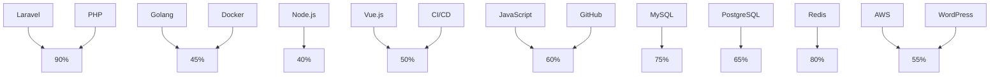

# Hi, I'm Idada Osaigbovo James! 🚀

## 👨‍💻 About Me
I'm a Laravel developer with **3+ years of experience**, specializing in building scalable backend solutions, optimizing API performance, and integrating third-party services. I also work with Vue.js for frontend development and have experience with Go for backend services.

## 🔥 Tech Stack & Expertise

### Backend:
- **Laravel** (7-12) - Advanced 🚀
- PHP - Advanced 🔥
- Go (Golang) - Beginner 🌱
- Node.js - Beginner ⚡

### Frontend:
- Vue.js - Intermediate 🎨
- JavaScript - Intermediate 📜

### Databases:
- MySQL - Advanced 🛢️
- PostgreSQL - Intermediate 📊
- Redis - Intermediate ⚡

### DevOps & Tools:
- Docker - Intermediate 🐳
- Git & GitHub - Advanced 🏗️
- CI/CD - Intermediate ⚙️
- AWS - Beginner ☁️

### Other Skills:
- Typesense - Intermediate 🔍
- WordPress Plugin Development - Intermediate 🔧
- Payment Integration - Intermediate 💳
- API Design & Optimization - Advanced 🔗

## 📌 Notable Projects
- **Learning Management System (LMS):** Built and optimized an LMS platform with role-based access control and real-time data synchronization.
- **WordPress Plugin (Typesense Integration):** Developed a custom plugin to manage and display daily tasks efficiently.
- **Event Management System:** Implementing Laravel + Vue with Paystack for seamless ticketing and transactions.
- **High-Traffic API Integration:** Optimized API requests handling 40,000+ batch updates per hour.

## 📊 Skills Chart

## 📫 Connect with Me
- GitHub: [Obsidian Blaze](https://github.com/ObsidianBlaze)
- LinkedIn: [Idada Osaigbovo James](https://www.linkedin.com/in/osaigbovojamesidada)
- Email: idadaosaigbovo@gmail.com

Let's build something awesome together! 🚀

<!--
### Want to know about this guy? 👋
My Name is Idada Osaigbovo James but I go by Osas. 
⚡ Honestly, I am an atypical guy. Why? Well, I love Java and Python. I do not engage in those banter that slanders one for another. 
🌱 I am a natural Java Developer. After all, I have James in my name, like James Goslin. 
😄 I learn really fast and I am confident on my learning speed. 
🤔 As much as I am eccentric, I have a penchant for collaborating with and leading a team. 
💬 I am pretty good with Java EE, SE, and Andriod, Python, Php and Laravel, Javascript, Microsoft sql server. 
🔭 I’m currently working on an enterprise application with laravel as the sole backend developer(I am badass :-> )! 
👯 At the pinnacle of my career, I would ensure I make a meaningful impact to both Africa and the world at large! 
⚡ I make open source contributions.

<!--
**ObsidianBlaze/ObsidianBlaze** is a ✨ _special_ ✨ repository because its `README.md` (this file) appears on your GitHub profile.

Here are some ideas to get you started:

- 🔭 I’m currently working on ...
- 🌱 I’m currently learning ...
- 👯 I’m looking to collaborate on ...
- 🤔 I’m looking for help with ...
- 💬 Ask me about ...
- 📫 How to reach me: ...
- 😄 Pronouns: ...
- ⚡ Fun fact: ...
-->
